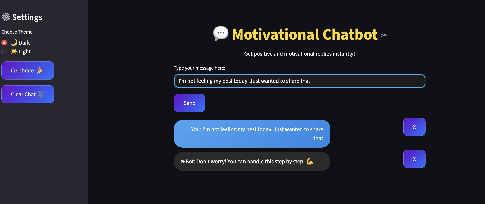

# Sentiment-Aware Chatbot 🤖💬

A Python-based **sentiment-aware chatbot** that provides motivational and supportive replies.  
It uses **BERT** for sentiment detection and **GPT-2** for generating dynamic text responses.  
The chatbot comes with a beautiful **Streamlit interface** to interact in real time.  

---

## ✨ Features
- 🔍 Sentiment analysis with **BERT**
- 💡 Motivational replies for positive/negative moods
- 🧠 Natural responses using **GPT-2**
- 🎨 Interactive and user-friendly **Streamlit UI**
- ⚡ Runs locally on CPU/GPU (supports Apple MPS too)

---

